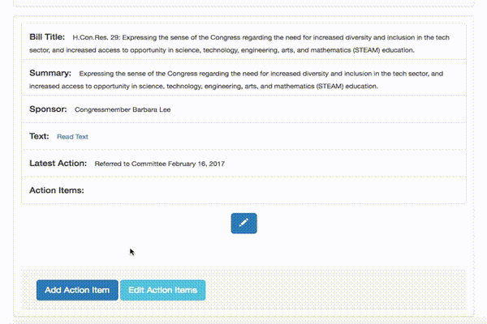
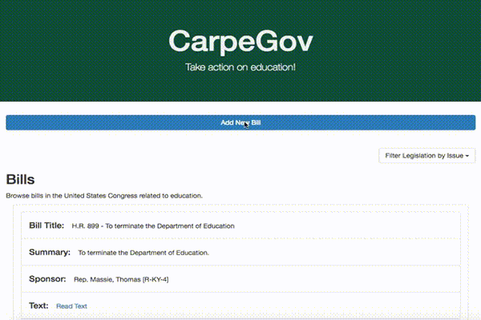
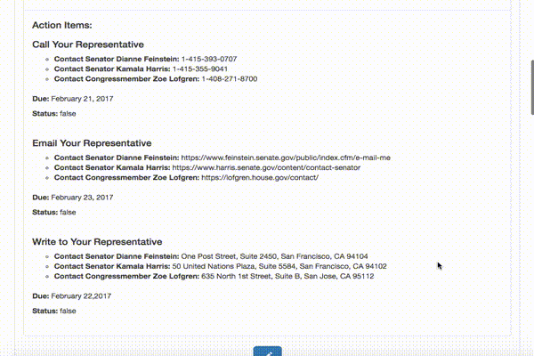

# CarpeGov
Civic engagement tool for administrators to store, maintain and track action taken on congressional bills related to education.

Checkout the application here: [CarpeGov](http://carpegov.herokuapp.com/ "CarpeGov Homepage")

## Technologies Used

* MongoDB
* Node.js
* Express
* AJAX
* jQuery
* Bootstrap
* Heroku

## Existing Features

* Admin can get, post, update and delete bills
* Admin can add, associate, edit and remove  action items related to each bill
* Bills can be filtered via dropdown issues menu

## Planned Features

* Make it so user can add issues to new or existing bills
* Make the bills searchable by text
* Make filters dropdown update based on new issues added
* Linking phone and email to action items
* Status as a button to toggle Complete or Incomplete
* Frontend validation
* Backend validation
* Extend to API on congressional bills and representatives
* Login for administrators and users
* Dashboard to track action items
* Expanding models e.g. archive, users, representatives

## Demo

**Create and Edit Action Items**

**Add Bill**

**Edit Bill**

**Filter Bills**

## License

GNU General Public License

## Built by

**Yan-Yin Choy**, *Developer* - [Github](http://github.com/ychoy)
**Weston Dombroski**, *Developer* -[Github](http://github.com/westondombroski)

